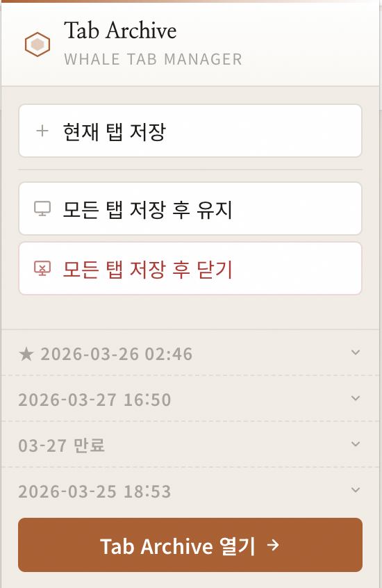

# Tab Archive

**Whale 브라우저용 탭 관리 확장 프로그램**

현재 열려 있는 탭을 그룹 단위로 저장하고, 랜딩 페이지에서 저장된 탭을 관리하거나 다시 열 수 있습니다.
Claude Code를 이용해 작성했습니다.

<br>

## 스크린샷

### 랜딩 페이지


### 팝업



<br>

## 주요 기능

### 탭 저장
| 기능 | 설명 |
|------|------|
| **현재 탭 저장** | 활성 탭을 그룹으로 저장 |
| **전체 탭 저장 후 유지** | 모든 탭을 저장하고 탭은 그대로 유지 |
| **전체 탭 저장 후 닫기** | 모든 탭을 저장하고 일괄 닫기 |
| **TTL 설정** | 그룹에 만료 시각 지정 (시간 단위 또는 날짜 지정) |
| **만료 전 알림** | 그룹 만료 하루 전 브라우저 알림 발송 |

### 랜딩 페이지 — 세션 관리
| 기능 | 설명 |
|------|------|
| **탭 열기** | 저장된 탭 클릭 시 새 탭으로 열기 |
| **그룹 이름 편집** | 그룹 이름을 인라인으로 수정 |
| **그룹 삭제** | 그룹 삭제 (확인 모달 포함) |
| **그룹 병합** | 여러 그룹을 선택해 하나로 병합 |
| **빈 세션 추가** | 탭 없이 이름만 있는 새 세션 직접 생성 |
| **즐겨찾기** | 그룹을 즐겨찾기해 목록 최상단에 고정 |
| **태그** | 그룹에 태그 추가/삭제, 미사용 태그 자동 정리 |
| **탭 개별 삭제** | 그룹 내 탭 단위 삭제 |
| **탭 드래그 이동** | 드래그 앤 드롭으로 탭 순서 변경 및 그룹 간 이동 |

### 랜딩 페이지 — 탐색 및 검색
| 기능 | 설명 |
|------|------|
| **실시간 검색** | 그룹 이름 · 탭 제목 · URL · 태그로 즉시 필터링 |
| **세션 사이드바** | 좌측 사이드바에서 세션 클릭 시 해당 그룹으로 스크롤 이동 |
| **태그 필터** | 사이드바 태그 탭에서 태그 클릭 시 해당 태그 그룹만 표시 |
| **태그 자동완성** | 태그 입력 시 기존 태그 자동완성 제안 |

### 랜딩 페이지 — 뷰 컨트롤
| 기능 | 설명 |
|------|------|
| **그룹 Fold / Unfold** | 그룹 헤더 클릭으로 접기/펼치기 |
| **전체 Fold** | 모든 그룹 일괄 접기/펼치기 |
| **팝업에서 확인** | 팝업에서 저장된 그룹 목록 확인 및 탭 이동 |

<br>

## 설치 방법

1. 이 저장소를 클론합니다.
   ```bash
   git clone https://github.com/your-username/whale-tap-manager.git
   ```

2. Whale 브라우저에서 `whale://extensions` 로 이동합니다.

3. **개발자 모드**를 활성화합니다.

4. **압축 해제된 확장 프로그램 로드**를 클릭하고 클론한 폴더를 선택합니다.

<br>

## 기술 스택

- **JavaScript** (ES6+)
- **HTML5 / CSS3**
- **Whale Extension API** (Chromium 기반, `chrome.*` API 호환)
- **Manifest V3**

<br>

## 프로젝트 구조

```
whale-tap-manager/
├── manifest.json               # 확장 프로그램 설정
├── popup.html / popup.css      # 팝업 UI
├── landing.html / landing.css  # 랜딩 페이지 UI
├── src/
│   ├── popup.js                # 팝업 스크립트
│   ├── landing.js              # 랜딩 페이지 스크립트
│   ├── tab-group.js            # 탭 그룹 비즈니스 로직
│   ├── tab-save.js             # 탭 저장 로직
│   └── background.js           # 알람/알림 서비스 워커
├── icons/                      # 확장 프로그램 아이콘
└── spec/                       # 기능 요구사항 및 설계 문서
```

<br>

## 참고 문헌

- [Whale 확장 앱 개발 가이드](https://developers.whale.naver.com/documentation/extensions/overview/)
- [Chrome Extension API (Whale 호환)](https://developer.chrome.com/docs/extensions/)
