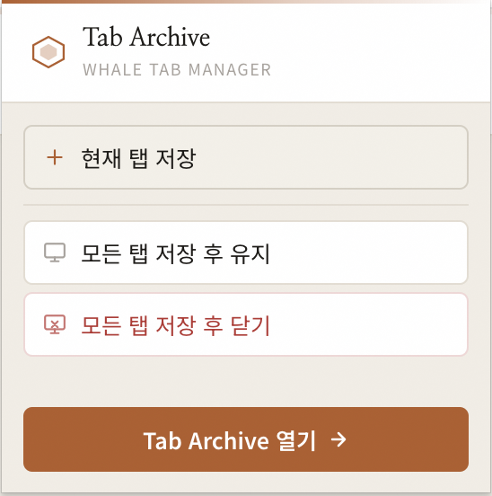

# Tab Archive

**Whale 브라우저용 탭 관리 확장 프로그램**

현재 열려 있는 탭을 그룹 단위로 저장하고, 랜딩 페이지에서 저장된 탭을 관리하거나 다시 열 수 있습니다.

<br>

## 스크린샷

### 랜딩 페이지


### 팝업



<br>

## 주요 기능

| 기능 | 설명 |
|------|------|
| **탭 저장** | 현재 탭 또는 전체 탭을 그룹으로 저장 |
| **저장 후 닫기 / 유지** | 전체 탭 저장 시 탭을 닫거나 유지하도록 선택 |
| **탭 열기** | 저장된 탭을 클릭해 새 탭으로 열기 |
| **그룹 관리** | 그룹 이름 편집, 삭제, 병합 |
| **탭 관리** | 그룹 내 개별 탭 삭제, 드래그로 순서 변경 및 그룹 이동 |
| **검색** | 그룹 이름 · 탭 제목 · URL 실시간 필터링 |
| **Fold / Unfold** | 각 그룹 또는 전체 그룹 접기 / 펼치기 |
| **즐겨찾기** | 그룹을 즐겨찾기하여 목록 최상단에 고정 |
| **빈 세션 추가** | 탭 없이 이름만 있는 빈 그룹 직접 생성 |
| **세션 사이드바** | 좌측 사이드바에서 세션 클릭 시 해당 그룹으로 빠르게 이동 |

<br>

## 설치 방법

1. 이 저장소를 클론합니다.
   ```bash
   git clone https://github.com/your-username/whale-tap-manager.git
   ```

2. Whale 브라우저에서 `whale://extensions` 로 이동합니다.

3. **개발자 모드**를 활성화합니다.

4. **압축 해제된 확장 프로그램 로드**를 클릭하고 클론한 폴더를 선택합니다.

<br>

## 기술 스택

- **JavaScript** (ES6+)
- **HTML5 / CSS3**
- **Whale Extension API** (Chromium 기반, `chrome.*` API 호환)
- **Manifest V3**

<br>

## 프로젝트 구조

```
whale-tap-manager/
├── manifest.json          # 확장 프로그램 설정
├── popup.html / popup.css # 팝업 UI
├── landing.html / landing.css  # 랜딩 페이지 UI
├── src/
│   ├── popup.js           # 팝업 스크립트
│   ├── landing.js         # 랜딩 페이지 스크립트
│   ├── tab-group.js       # 탭 그룹 비즈니스 로직
│   └── tab-save.js        # 탭 저장 로직
├── icons/                 # 확장 프로그램 아이콘
└── spec/                  # 기능 요구사항 및 설계 문서
```

<br>

## 참고 문헌

- [Whale 확장 앱 개발 가이드](https://developers.whale.naver.com/documentation/extensions/overview/)
- [Chrome Extension API (Whale 호환)](https://developer.chrome.com/docs/extensions/)
